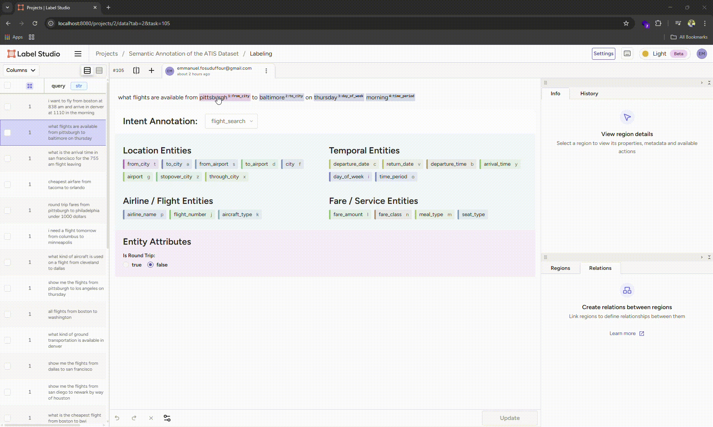

# High-Quality Semantic Annotation of the ATIS Dataset for Spoken Language Understanding (SLU)  
**Intent Classification, Slot Filling, and Semantic Relations.**

 

## Project Overview
### Problem Statement
The goal of this project is to create a **high-quality annotated ATIS dataset** for training and evaluating an **NLP-based airline travel assistant**. The system must understand user requests related to flights, fares, airports, schedules, and airline services. 

This dataset will support:
- Intent classification
- Named Entity Recognition (NER) / Slot filling
- Entity attributes and normalization
- Semantic relations between entities.

## Skills Demonstrated
- Intent classification and NER.
- Temporal normalization.
- Annotation tooling: **Label-studio**.


### Use Cases
The annotated dataset can be used to:
- Train conversational AI systems (chatbots, voice assistants).
- Benchmark intent classification and slot-filling models.

## Dataset Description
### Source Dataset
- ATIS (Airline Travel Information System)
- User queries are short, spoken=language-style utterances. eg: "show me the cheapest flight from Boston to Denver on Friday morning".
- The Language used is `English`.
- Text preprocessing:
  - Lovercased.
  - Punctuation removed.
  - Spoken-style queries preserved.

## Annotation Tasks
1. Intent Classification (utterance-level)
2. Entity Annotation (NER / Slots)
3. Entity Attributes
4. Semantic Relations

## Intent Annotation Guidelines
### Intent Definition
An intent represents the primary goal of the user's request.
Each utterance mush have **exactly one primary intent**.   

| Intent Name | Description|
|--------|-----------|
|`flight_search`| Searching for flights |
| `flight_schedule` | Asking about departure / arrival times |
| `airfare_query` | Asking about ticket prices |
| `airline_query` | Asking about airlines operating flights |
| `airport_information` | Asking about airports or airport services |
| `ground_service` | Transportation to / from airport |
| `flight_status` | Checking status of a flight |
| `meal_request` | Asking about in-flight meals |
| `restriction_query` | Fare rules or restrictions |
| `distance_query` | Distance between locations |
| `capacity_query` | Seat availability |
| `aircraft_query` | Aircraft type |
| `miscellaneous` | Airline-related but uncategorized |

### Intent Selection Rules
- Choose the dominant user goal, not secondary details.
- Do not assign multiple intents.
- If ambiguous, prefer the intent that best supports automation.

Example
> What is the cheapest flight from New York to Chicago?

Intent: `airfare_query`
(Not `flight_search`, because price is the primary focus.)

## Entity (Slot) Annotation Guidelines
### Entity Definition
Entities represent domain-specific information required to fulfill the intent.

#### Locations
| Entity | Description |
|---------|-------------|
| `from_city` | Departure city |
| `to_city` | Arrival city |
| `from_airport` | Departure airport |
| `to_airport` | Arrival airport |
| `city` | Generic city reference |
| `airport` | Generic airport reference |

#### Temporal
| Entity | Description |
|---------|-------------|
| `departure_date` | Date of departure |
| `return_date` | Date of return |
| `departure_time` | Time of departure |
| `arrival_time` | Time of arrival |
| `day_of_week` | Monday-Sunday |
| `time_period` | morning, evening, night |

#### Airline & Flight
| Entity | Description |
|---------|-------------|
| `airline_name` | Airline operator |
| `flight_number` | Specific flight |
| `aircraft_type` | Plane model |


#### Fare & Service 
| Entity | Description |
|---------|-------------|
| `fare_amount` | Price |
| `fare_class` | Economy, business |
| `meal_type` | Breakfast, dinner |
| `seat_type` | Aisle, window |

### Entity Annotation Rules
- Annotate the minimal span (no extra words).
- Do not infer missing information.
- Do not normalize text at this stage (keep original wording).
- Every entity must belong to the predefined entity list.


## Entity Attributes
Attributes provide structured meaning to entities.

| Attribute | Applies to | Example |
|-----------|------------|---------|
| `normalized_value` | date, time, city | `Friday` -> `2024-03-15` |
| `is_round_trip` | flight_search | true / false |
| `relative_time` | date | today, tomorrow |
| `currency` | fare_amount | USD |
| `specificity` | time | exact / approximate |

### Attribute Rules
- Attributes must be logically derivable from the text.
- Normalization should follow ISO standards where applicable.
- Attributes are optional but encouraged when umambiguous.

## Semantic Relations
| Relation | Description |
|----------|-------------|
| `route_from` | Connect flight to departure location |
| `route_to` | Connect flight to arrival location |
| `operated_by` | Flight -> airline |
| `scheduled_on` | Flight -> time |
| `priced_at` | Flight -> fare |

## Annotation Edge Cases
### Ambiguous Cities
> Portland
- Annotate as `city`.
- Do not assume Oregon or Maine.

### Multiple Locations
> Flights from Boston to New York via Chicago.
- Annotate all locations
- Relations must clearly distinguish origin, destination, stopover.

### Incomplete Queries
> Flights to Denver
- Annotate `to_city`.
- Intent still required.


## Project Structure
```bash
atis-semantic-annotation/
│
├── annotation_schema.json # Schema definition of the annotation system
│
├── ATIS Dataset.csv # Original ATIS queries
│
├── annotated_ATIS_dataset.json # Annotated ATIS queries
│
├── README.md # Project documentation
│
└── assets/ # Screenshots for README.md
```